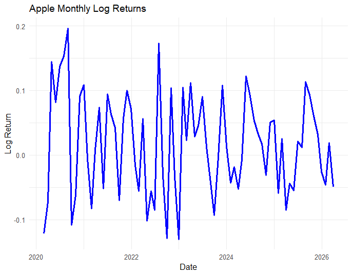

# Stock Return Analysis using R

This project analyses Apple stock returns using R.

This project demonstrates financial data analysis using R,

including return calculation and visualization for decision-making.

## Steps:
- Data collection using tidyquant
- Monthly price conversion
- Log return calculation
- Data visualisation

## Tools:
- R
- tidyquant
- ggplot2

## Insights:
- Stock returns show volatility
- Returns fluctuate over time

## Output:

